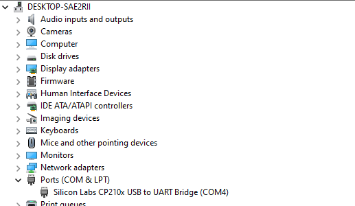

# Esp32 Project

**Msc in informatics and Telecommunications build in Rust with use of ESP32 microcontroller.**

### DEPENDENCIES

1. Install Rust language on your computer from **[installer/lnk](https://www.rust-lang.org/learn/get-started)**

2. Install the ESP-IDF to your Computer. This is development environment for the ESP32 and can be found in **[ESP-IDF/lnk](https://docs.espressif.com/projects/esp-idf/en/latest/esp32/get-started/index.html)**

3. Install the Xtensa toolchain that required to build the Rust code for ESP32 and can be found in **[Xtensa/lnk](https://docs.espressif.com/projects/esp-idf/en/latest/esp32/get-started/linux-setup.html#install-the-xtensa-toolchain)**

4. Install the rust-esp32 crate for developing ESP32 using Rust which can be found in **[rust-esp32-crate/lnk](https://crates.io/crates/esp32-hal)**


### CREATE NEW PROJECT

1. Create a new  directory 'project_name' using the esp32-rs template from the rust-esp32 crate. Use the following command

    `cargo new --template esp32-rs project_name`

**Next steps**

* Replace the main.rs file with the code you provide
* Connect your ESP32 board to your computer using a USB Cable
    
    

* Build and flash the code to your ESP32 using the following command

    ```
        $ cd project_name
        $ cargo esp flash --release
    ```

This command will compile the code in release mode and flash it to the ESP32.


# Project 1 

**Design and implement an application that performs the dimming of two LEDs to be connected to the ESP32. The red LED's de-activation will be started by using button switch SW1. Similarly the start of the green led dimming will be done using button switch SW2. When starting the application both LEDs shall have the same frequency of dimming. By double clicking on SW2 the flashing frequency of the green led will be doubled. Students are required to develop and document the application. The development includes: Specification of the application, design of connections description of the algorithm, quoting (and commenting) code, debugging strategy and results, overall documentation, reporting problems and suggestions for improvements. In the first application, approach the application using simple (non-optimized) code with delay loops (without using the delay() function).**

**[Assignment-1 solution](./assignment_1)**

# Project 2

**Design and implement an improved version of the code of the first application. In the second application, approach the application using timers, interrupts and low-power functions for optimized code development.**

**[Assignment-2 solution](./assignment_2)**

# Project files
* **[Assignment-Report](https://github.com/vasnastos/Esp32_PMS/raw/main/vasileios_nastos_137_panagiotis_koromilias_150_sensors_semester_assignment.pdf)**
* **[Assignemnt-Presentation](https://github.com/vasnastos/Esp32_PMS/raw/main/vasileios_nastos_137_panagiotis_koromilias_150_sensors_semester_presentation.pdf)**


