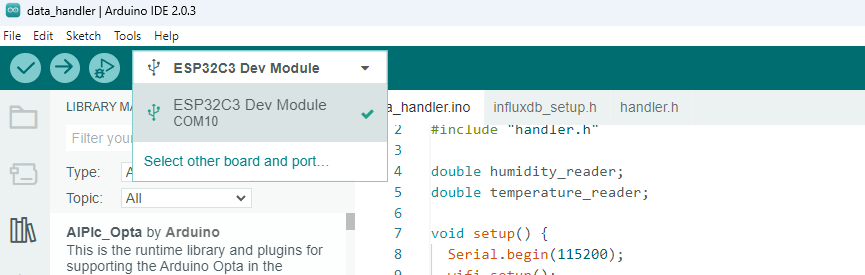

# Weather Application using ESP32, Influx DB and Grafana

### Connect ESP32C3 to Arduino IDE

    1. Download Arduino IDE [https://www.arduino.cc/en/software](https://www.arduino.cc/en/software)
    2. Install us-to-Serial Bridge Driver [./CP210x_Windows_Drivers.zip](./CP210x_Windows_Drivers.zip)
    3. Go to File>Preferences and Fill in the Additional Board Manager URLs with
        ```
            https://raw.githubusercontent.com/espressif/arduino-esp32/gh-pages/package_esp32_index.json
        ```
    4. Now navigate to Tools > Board > Boards Manager and filter your search by entering ‘esp32‘. Look for ESP32 by Espressif Systems. Click on that entry, and then choose Install.
    5. After installing the ESP32 Arduino Core, restart your Arduino IDE and navigate to Tools > Board to ensure you have ESP32 boards available.

    


### Create InfluxDB bucket

### Create Grafana Dashboard

### Links
* [https://randomnerdtutorials.com/installing-the-esp32-board-in-arduino-ide-windows-instructions/](https://randomnerdtutorials.com/installing-the-esp32-board-in-arduino-ide-windows-instructions/)
* [https://www.the-diy-life.com/grafana-weather-dashboard-using-influxdb-and-an-esp32-in-depth-tutorial/](https://www.the-diy-life.com/grafana-weather-dashboard-using-influxdb-and-an-esp32-in-depth-tutorial/)
* [https://projecthub.arduino.cc/arcaegecengiz/using-dht11-12f621](https://projecthub.arduino.cc/arcaegecengiz/using-dht11-12f621)
* [https://lastminuteengineers.com/esp32-i2c-lcd-tutorial/](https://lastminuteengineers.com/esp32-i2c-lcd-tutorial/)
* [https://wokwi.com/projects/328919955147850324](https://wokwi.com/projects/328919955147850324)
* [https://grafana.com/docs/grafana/latest/administration/data-source-management/#add-a-data-source/](https://grafana.com/docs/grafana/latest/administration/data-source-management/#add-a-data-source/)